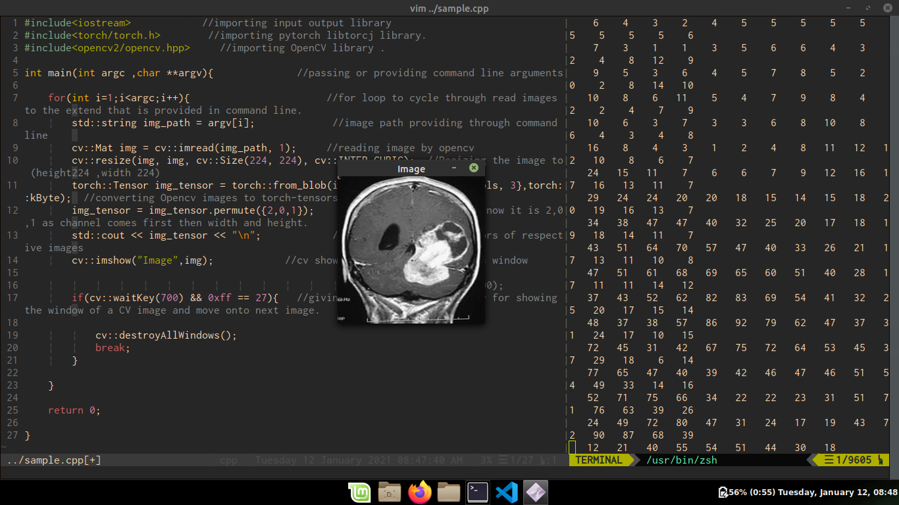

# Pytorch_CPP

-Libtorch-orange)

#### This are the initial steps of a project to predict Brain tumour on some specific MRI images .
##### using C++ ,OpenCV2 and Libtorch (ie,Pytorch C++)

#### Main code is in sample.cpp file and build using cmake .

